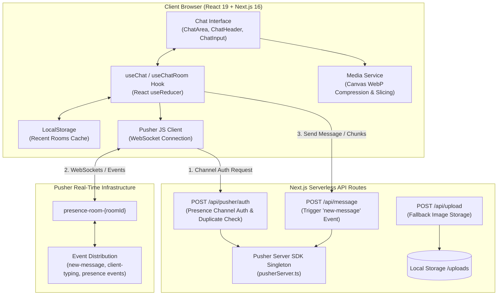
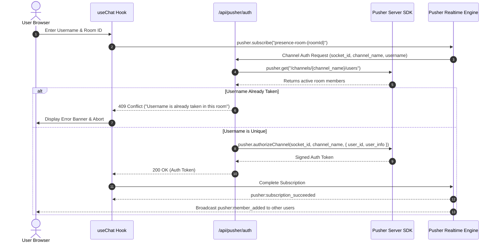
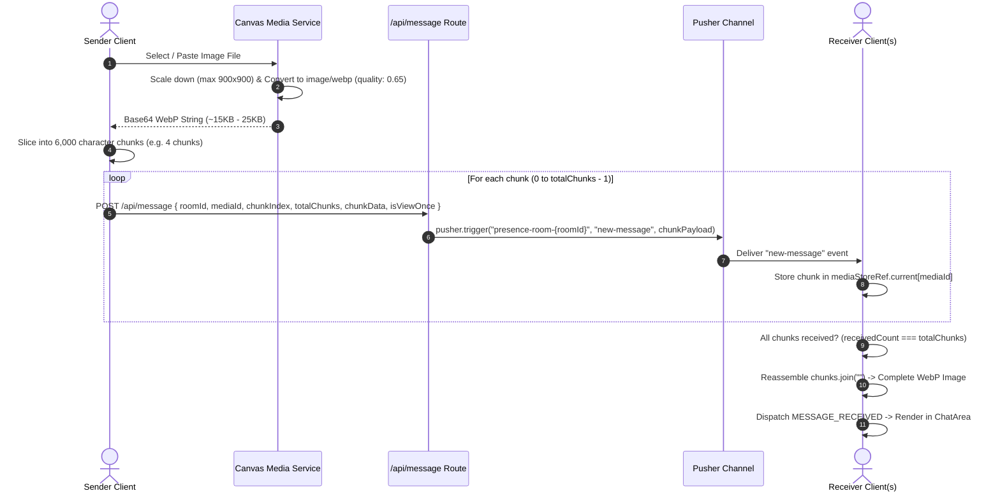
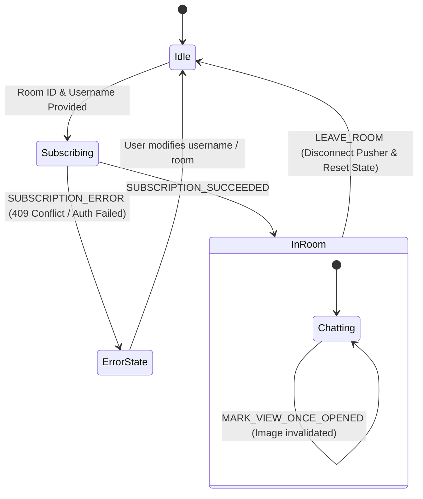

# ChatU — Real-Time Ephemeral Web Messaging

<div align="center">


[](https://nextjs.org/)
[](https://react.dev/)
[](https://pusher.com/)
[](https://tailwindcss.com/)
[](https://www.typescriptlang.org/)
[](LICENSE)

**ChatU** is a high-performance, serverless real-time chat application built with **Next.js 16 (App Router)**, **React 19**, and **Pusher WebSockets**. It delivers ultra-low-latency messaging, client-side WebP image compression, chunked in-memory media streaming, ephemeral "View Once" media, live presence tracking, and contextual replies—all without maintaining persistent database state or complex WebSocket server infrastructure.

[Key Features](#-key-features) • [System Architecture](#-system-architecture) • [Project Structure](#-project-structure) • [Pusher & API Specifications](#-pusher--api-specifications) • [Getting Started](#-getting-started) • [Configuration](#-configuration) • [Troubleshooting](#-troubleshooting)

---

</div>

## 📖 Table of Contents

- [Overview & Philosophy](#-overview--philosophy)
- [Key Features](#-key-features)
- [System Architecture](#-system-architecture)
  - [High-Level Architecture](#high-level-architecture)
  - [Presence Channel Authentication & Collision Detection](#presence-channel-authentication--collision-detection)
  - [In-Memory Chunked Media Streaming Flow](#in-memory-chunked-media-streaming-flow)
  - [State Machine & Reducer Architecture](#state-machine--reducer-architecture)
- [Project Directory Structure](#-project-directory-structure)
- [Core Components & Hooks](#-core-components--hooks)
  - [Custom React Hooks](#custom-react-hooks)
  - [UI Components](#ui-components)
  - [Utility & Media Services](#utility--media-services)
- [Pusher & API Specifications](#-pusher--api-specifications)
  - [API Endpoints](#api-endpoints)
  - [Pusher Channels & Events](#pusher-channels--events)
  - [Message Data Models](#message-data-models)
- [Getting Started](#-getting-started)
  - [Prerequisites](#prerequisites)
  - [Pusher Account Setup](#pusher-account-setup)
  - [Installation & Environment Setup](#installation--environment-setup)
  - [Running the Application](#running-the-application)
- [Configuration Reference](#-configuration-reference)
- [Security & Privacy Model](#-security--privacy-model)
- [Troubleshooting & FAQs](#-troubleshooting--faqs)
- [Scripts & Development Commands](#-scripts--development-commands)
- [License](#-license)

---

## 💡 Overview & Philosophy

Traditional real-time web chat systems often demand dedicated stateful WebSocket servers (e.g., Socket.io nodes, Redis adapters, custom cluster managers) and persistent relational/document databases. 

**ChatU takes an alternative serverless-first, privacy-centric approach:**
1. **Serverless Real-Time Transport**: All real-time signaling, room membership, and broadcast distribution are delegated to **Pusher Channels**. Next.js serverless API routes handle authentication and server-triggered events.
2. **Ephemeral Memory Model**: Chat messages, attached photos, and live room states live solely in volatile client memory and transient WebSocket frames. Leaving a room or closing the browser window purges your session data.
3. **Bandwidth-Optimized Media Transport**: Image files are compressed directly on the browser's HTML5 Canvas into lightweight WebP format (~20KB) and sliced into 6KB segments. These segments stream across Pusher events without requiring third-party cloud storage buckets.
4. **Frictionless Onboarding**: No passwords, OAuth flows, or email verifications. Pick any room name and username to join instantly. Duplicate usernames within the same room are automatically blocked at the gateway level.

---

## ✨ Key Features

| Feature | Description |
| :--- | :--- |
| ⚡ **Real-Time Messaging** | Instant bidirectional message dispatch over encrypted Pusher WebSockets with sub-100ms latency. |
| 👥 **Presence & Collision Detection** | Live member count, active user list popover, and server-side duplicate username rejection (`HTTP 409 Conflict`). |
| 🖼️ **In-Memory Media Streaming** | Automatic client-side canvas compression to WebP and payload chunking (~6KB chunks) to bypass WebSocket payload constraints. |
| 👁️ **"View Once" Media** | WhatsApp-style ephemeral image messages that can only be viewed in a lightbox once before being permanently purged from state. |
| 💬 **Contextual Replies** | Double-click or click the reply icon on any message bubble to attach a linked quote context to your response. |
| ✍️ **Typing Indicators** | Debounced real-time typing indicators powered by Pusher Client Events (`client-typing`) with animated bouncing dots. |
| 🕒 **Recent Rooms Cache** | LocalStorage-backed caching of up to 5 recently joined rooms for one-click rejoining and instant room management. |
| 🎨 **Dynamic Avatars** | Deterministic, seed-based vector avatars powered by DiceBear (`shape-grid` for rooms, `notionists` for users). |
| 🔍 **Fullscreen Lightbox** | Click-to-enlarge image lightbox modal with smooth backdrop blur and dismiss controls. |
| 📱 **Responsive & Mobile Ready** | Optimized touch interactions (`touch-manipulation`, active states, clipboard image paste) and full PWA web manifest support. |

---

## 🏗️ System Architecture

### High-Level Architecture



---

### Presence Channel Authentication & Collision Detection

When a user attempts to join `presence-room-${roomId}`, Pusher triggers an authorization callback to `/api/pusher/auth`. The server validates that the requested username does not already exist in the channel:



---

### In-Memory Chunked Media Streaming Flow

Pusher has a strict maximum payload size of **10 KB** per event on free/standard tiers. ChatU resolves this through automated client-side canvas WebP compression and deterministic payload chunking:



---

### State Machine & Reducer Architecture

The `useChat` hook relies on a predictable state machine (`chatReducer`) to manage all chat interactions:



---

## 📂 Project Directory Structure

```text
d:/chatu/
├── .env.example                 # Template for environment variables
├── .gitignore                   # Git ignore specifications
├── eslint.config.mjs            # ESLint flat configuration
├── next.config.ts               # Next.js build and runtime configuration
├── package.json                 # Project dependencies and script declarations
├── postcss.config.mjs           # PostCSS configuration for Tailwind CSS v4
├── tsconfig.json                # TypeScript compiler options
├── public/                      # Static assets and media files
│   ├── logo.png                 # Brand logo icon
│   ├── file.svg / globe.svg     # UI icons
│   └── uploads/                 # Server-side upload destination for fallback storage
└── src/
    ├── app/                     # Next.js App Router root
    │   ├── globals.css          # Tailwind CSS v4 imports and theme variables
    │   ├── layout.tsx           # Global HTML root layout, fonts, and OpenGraph metadata
    │   ├── manifest.ts          # Web App Manifest (PWA configuration)
    │   └── page.tsx             # Main chat application page orchestrator
    ├── components/
    │   └── chat/                # UI components
    │       ├── ChatArea.tsx     # Message feed, message bubbles, replies & lightbox
    │       ├── ChatHeader.tsx   # Header bar, room avatar, member count & typing dots
    │       ├── ChatInput.tsx    # Message input, image picker, View Once toggle & send
    │       ├── JoinRoomForm.tsx # Reusable room and username entry form
    │       ├── JoinRoomModal.tsx# Modal wrapper to join a new room
    │       └── RecentRooms.tsx  # Grid display of cached rooms from localStorage
    ├── hooks/
    │   ├── useChat.ts           # Primary reducer-based Pusher state orchestrator
    │   ├── useChatRoom.ts       # Secondary useState-based hook implementation
    │   └── useRecentRooms.ts    # LocalStorage manager for recent room history (LRU 5)
    ├── pages/
    │   └── api/                 # Next.js Serverless API endpoints
    │       ├── message.ts       # Pusher event dispatcher for text & media chunks
    │       ├── upload.ts        # Base64 fallback disk upload endpoint (10MB limit)
    │       └── pusher/
    │           └── auth.ts      # Pusher Presence Channel authorization & duplicate guard
    ├── services/
    │   ├── chatService.ts       # Client API abstraction & image chunking logic
    │   ├── mediaService.ts      # HTML5 Canvas WebP image compressor
    │   └── pusherServer.ts      # Pusher Server SDK singleton instance
    └── types/
        └── chat.ts              # TypeScript interfaces for Message and RecentRoom
```

---

## 🧩 Core Components & Hooks

### Custom React Hooks

#### `useChat(roomId, username, options)` (`src/hooks/useChat.ts`)
The primary chat orchestrator. Manages Pusher subscription lifecycle, event binding, typing states, contextual replies, and image chunk reassembly using `useReducer`.

- **Exposed State & Handlers**:
  - `messages`: Array of `Message` objects currently loaded in state.
  - `users`: Array of active usernames present in the room.
  - `typingUsers`: `Set<string>` containing usernames actively typing.
  - `replyTo`: `Message | null` representing the message currently targeted for reply.
  - `loginError`: Error string when subscription fails (e.g. `409 Username taken`).
  - `pusherClient`: Active `Pusher` instance.
  - `sendMessage(text, imageUrl?, isViewOnce?)`: Sends a message, automatically chunking images if present.
  - `leaveRoom()`: Unsubscribes from the channel, disconnects Pusher, and resets state.
  - `handleTyping(isTyping)`: Dispatches `client-typing` event to room members.
  - `setReplyTo(message)`: Sets or clears reply target.
  - `markViewOnceOpened(messageId)`: Marks a "View Once" message as opened and strips its image data.

#### `useRecentRooms()` (`src/hooks/useRecentRooms.ts`)
Manages `localStorage` persistence for recently joined rooms (`chatu_recent_rooms`).
- **Features**:
  - Caps saved rooms at **5** entries (Most Recently Used first).
  - Deduplicates room entries on rejoining.
  - Exposes `saveRecentRoom(roomId, username)` and `deleteRecentRoom(e, room, onEmpty)`.

---

### UI Components

#### `ChatArea` (`src/components/chat/ChatArea.tsx`)
- Renders system notices, incoming messages, and self messages.
- Displays DiceBear `notionists` avatar for remote users and self.
- Double-click message bubble to trigger reply.
- Dedicated reply button (`CornerUpLeft`) visible on hover or mobile tap.
- Formats "View Once" messages with WhatsApp-style badge pills (`Opened` vs `Photo 1`).
- Built-in fullscreen **Lightbox Modal** with backdrop blur and keyboard/click dismiss.

#### `ChatHeader` (`src/components/chat/ChatHeader.tsx`)
- Displays room identity using DiceBear `shape-grid` vector avatar.
- Displays live member count with an interactive popover listing all online participants.
- Animated bouncing dots indicator when other participants are typing.
- "Leave Room" button with graceful disconnect cleanup.

#### `ChatInput` (`src/components/chat/ChatInput.tsx`)
- Auto-focused text input supporting both standard typing and direct clipboard image paste (`Ctrl+V` / `Cmd+V`).
- Attachment button triggering hidden file input (`image/*`).
- Client-side WebP compression feedback with inline loading spinner (`Loader2`).
- **View Once Toggle (`1`)**: Allows senders to mark attached images as ephemeral.
- Reply context banner with cancel button (`X`).

#### `RecentRooms` (`src/components/chat/RecentRooms.tsx`)
- Visual card grid of saved rooms from previous sessions.
- Room-specific DiceBear avatars and formatted timestamps.
- One-click room connection and individual room deletion.

---

### Utility & Media Services

#### `mediaService.ts` (`src/services/mediaService.ts`)
Performs client-side image compression:
- Scales oversized images down to maximum `900x900px` maintaining aspect ratio.
- Draws to an offscreen HTML5 `<canvas>` and outputs `image/webp` at `0.65` quality.
- Compresses typical multi-megabyte photos down to ~15KB–25KB.

#### `chatService.ts` (`src/services/chatService.ts`)
Handles message payload transmission:
- Inspects payload size; if an `imageUrl` is present, chunks the base64 string into **6,000 character segments**.
- Transmits each segment via sequential `POST /api/message` requests with chunk metadata (`chunkIndex`, `totalChunks`, `mediaId`).

---

## 📡 Pusher & API Specifications

### API Endpoints

#### 1. Channel Authorization
- **URL**: `POST /api/pusher/auth`
- **Description**: Authenticates Pusher Presence Channel subscriptions and verifies username uniqueness.
- **Request Body**:
  ```json
  {
    "socket_id": "12345.67890",
    "channel_name": "presence-room-general",
    "username": "Alice"
  }
  ```
- **Responses**:
  - `200 OK`: Returns Pusher signed authorization object.
  - `400 Bad Request`: Missing `socket_id`, `channel_name`, or `username`.
  - `409 Conflict`: `{"message": "Username is already taken in this room"}`.
  - `500 Internal Server Error`: Pusher authentication failure.

#### 2. Message Dispatch
- **URL**: `POST /api/message`
- **Description**: Triggers a `new-message` event on the target room presence channel.
- **Request Body**:
  ```json
  {
    "roomId": "general",
    "username": "Alice",
    "text": "Hello world!",
    "timestamp": 1717800000000,
    "replyTo": {
      "username": "Bob",
      "text": "Hey Alice!"
    },
    "imageUrl": "data:image/webp;base64,...",
    "isViewOnce": false,
    "mediaId": "uuid-v4",
    "chunkIndex": 0,
    "totalChunks": 1,
    "chunkData": "data:image/webp;base64,..."
  }
  ```
- **Responses**:
  - `200 OK`: `{"success": true}`
  - `500 Internal Server Error`: `{"success": false, "error": "Failed to trigger event"}`

#### 3. Fallback Image Upload
- **URL**: `POST /api/upload`
- **Description**: Stores base64 images directly on server disk (`/public/uploads`) if fallback storage is needed.
- **Request Body**: `{"image": "data:image/png;base64,..."}`
- **Payload Limit**: `10MB`

---

### Pusher Channels & Events

All rooms use the Pusher Presence channel naming format: `presence-room-${roomId}`.

| Event Name | Source | Direction | Description |
| :--- | :--- | :--- | :--- |
| `pusher:subscription_succeeded` | Pusher | Server → Client | Emitted when room join is approved. Contains initial user list. |
| `pusher:subscription_error` | Pusher | Server → Client | Emitted on auth failure or HTTP 409 (username taken). |
| `pusher:member_added` | Pusher | Server → Client | Broadcast when a new member joins the room. |
| `pusher:member_removed` | Pusher | Server → Client | Broadcast when a member disconnects or leaves. |
| `new-message` | API Route | Server → Client | Broadcast containing text, reply data, or media chunks. |
| `client-typing` | Pusher Client | Peer ↔ Peer | Client event indicating whether a user is currently typing. |

> [!IMPORTANT]
> **Client Events Requirement**: The `client-typing` event is a client event. You **MUST** enable **Client Events** in your Pusher Channels App Settings dashboard for typing indicators to function.

---

### Message Data Models

```typescript
// Core Message Entity
export interface Message {
  id: string;                      // Unique message UUID
  username: string;                // Sender display name (or "System")
  text: string;                    // Message text content
  timestamp: number;               // Epoch millisecond timestamp
  isSelf: boolean;                 // Whether the current user sent the message
  imageUrl?: string;               // Assembled base64 WebP image URL
  isViewOnce?: boolean;            // Whether image is ephemeral View Once
  isOpened?: boolean;              // Whether View Once image was already opened
  mediaId?: string;                // Identifier for chunked streaming
  replyTo?: {                      // Attached reply context
    username: string;
    text: string;
  };
}

// Recent Room History Entity
export interface RecentRoom {
  roomId: string;                  // Room identifier
  username: string;                // Username used in that room
  lastJoined: number;              // Timestamp of last visit
}
```

---

## 🚀 Getting Started

### Prerequisites
- **Node.js**: `v18.18.0` or higher (`v20.x` or `v22.x` recommended)
- **Package Manager**: `npm`, `pnpm`, or `yarn`
- **Pusher Account**: Free tier available at [pusher.com](https://pusher.com)

---

### Pusher Account Setup

1. Sign up or log in to your [Pusher Dashboard](https://dashboard.pusher.com/).
2. Click **Create App**.
3. Name your app (e.g., `ChatU-Dev`), choose a cluster closest to you (e.g., `mt1`, `ap2`, `eu`), and select **React** for frontend and **Node.js** for backend.
4. Navigate to **App Settings** in the left sidebar:
   - ✅ **Enable "Client Events"** (required for `client-typing`).
   - ✅ **Enable "Authorized Connections"**.
5. Navigate to **App Keys** to copy your credentials.

---

### Installation & Environment Setup

1. **Clone the repository**:
   ```bash
   git clone https://github.com/your-username/chatu.git
   cd chatu
   ```

2. **Install dependencies**:
   ```bash
   npm install
   ```

3. **Configure Environment Variables**:
   Create a `.env.local` file in the root directory:
   ```bash
   cp .env.example .env.local
   ```

4. **Populate `.env.local` with your Pusher keys**:
   ```env
   # Pusher Server Credentials (Private)
   PUSHER_APP_ID="your_pusher_app_id"
   PUSHER_SECRET="your_pusher_secret"

   # Pusher Client Credentials (Public)
   NEXT_PUBLIC_PUSHER_KEY="your_pusher_key"
   NEXT_PUBLIC_PUSHER_CLUSTER="your_pusher_cluster"
   ```

---

### Running the Application

1. **Start the development server**:
   ```bash
   npm run dev
   ```
2. Open [http://localhost:3000](http://localhost:3000) in your browser.
3. Open a second browser tab (or incognito window), enter the same Room ID with a different username, and start chatting in real-time!

---

## ⚙️ Configuration Reference

| Variable | Environment | Scope | Description | Example |
| :--- | :--- | :--- | :--- | :--- |
| `PUSHER_APP_ID` | Server | Private | Pusher Application ID | `1234567` |
| `PUSHER_SECRET` | Server | Private | Pusher Secret Key | `ab12cd34ef56gh78` |
| `NEXT_PUBLIC_PUSHER_KEY` | Client & Server | Public | Pusher App Key | `9876543210fedcba` |
| `NEXT_PUBLIC_PUSHER_CLUSTER` | Client & Server | Public | Pusher Data Center Cluster | `ap2`, `mt1`, `eu` |

---

## 🔒 Security & Privacy Model

- **Zero Database Retention**: Chat messages and streaming media never touch persistent SQL/NoSQL storage. Data exists only in client RAM and ephemeral WebSocket packets.
- **Serverless Authentication**: Users cannot join presence channels without obtaining a signed HMAC token from `/api/pusher/auth`.
- **Duplicate Prevention**: Channel user lists are queried before signing authorization tokens to prevent username spoofing and room collisions.
- **View Once Enforcement**: Once an ephemeral image is opened in the lightbox, the client dispatches `MARK_VIEW_ONCE_OPENED`, replacing the base64 URL with `undefined` in memory.

---

## 🛠️ Troubleshooting & FAQs

### 1. Error: `Username is already taken in this room` (HTTP 409)
- **Cause**: Another connected client in the same room is already using that display name.
- **Fix**: Choose a different username or wait for the inactive session to disconnect.

### 2. Typing indicators are not showing
- **Cause**: Client Events are disabled in your Pusher dashboard.
- **Fix**: Open your **Pusher Dashboard** → Select your App → **App Settings** → Check **"Enable client events"** → Save changes.

### 3. Error: `Missing Pusher configuration on server`
- **Cause**: `.env.local` is missing or keys are blank.
- **Fix**: Verify that all 4 variables (`PUSHER_APP_ID`, `PUSHER_SECRET`, `NEXT_PUBLIC_PUSHER_KEY`, `NEXT_PUBLIC_PUSHER_CLUSTER`) are correctly defined in `.env.local` and restart the development server (`npm run dev`).

### 4. Large images fail to send
- **Cause**: File cannot be compressed or browser canvas crashed.
- **Fix**: ChatU automatically compresses images to WebP. Ensure you are uploading a valid image format (`.png`, `.jpg`, `.jpeg`, `.webp`).

---

## 📜 Scripts & Development Commands

| Command | Description |
| :--- | :--- |
| `npm run dev` | Starts the Next.js development server on `http://localhost:3000` with Fast Refresh. |
| `npm run build` | Builds the production bundle and validates TypeScript types and ESLint rules. |
| `npm run start` | Runs the production build server. |
| `npm run lint` | Runs ESLint across all TypeScript and React files. |

---

## 📄 License

This project is open source and available under the [MIT License](LICENSE).

<div align="center">
  <sub>Built with ❤️ using Next.js 16, React 19, and Pusher Channels.</sub>
</div>